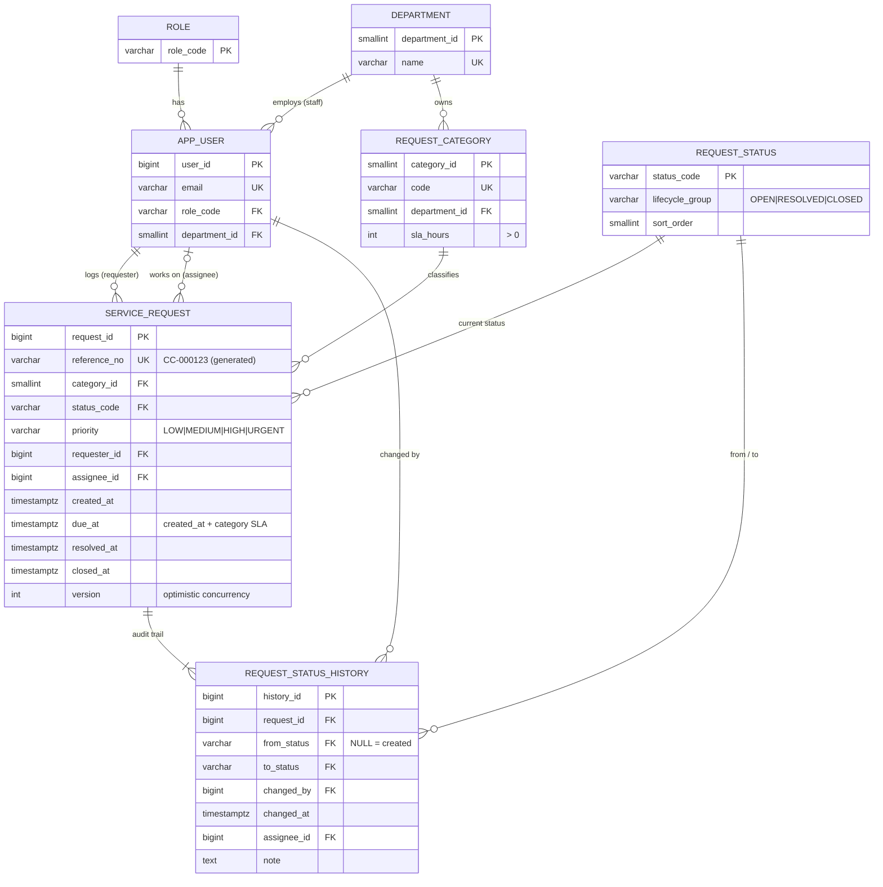

# CivicConnect data model (Person 3)

## Ownership and lifecycle

| Entity | Written by | Lifecycle / retention |
|---|---|---|
| `service_request` | Request intake (create) and lifecycle module (status changes) via `ServiceRequestRepository` | Never deleted by the application (the app role has no DELETE grant) |
| `request_status_history` | Only inside the same transaction as the status change | **Append-only**: UPDATE and DELETE are blocked by a trigger |
| `request_category`, `request_status`, `department`, `role` | Admin / migration scripts | Reference data. Deactivate with `is_active`; do not delete |
| `app_user` | Account module | Deactivate with `is_active`. `password_hash` is owned by the auth module |

## Integrity rules (defence in depth: UI → service → database)

| Rule | Enforced by |
|---|---|
| Status is a known value | FK `service_request.status_code → request_status` |
| Priority is a known value | CHECK `ck_request_priority` |
| ASSIGNED / IN_PROGRESS must have an assignee | CHECK `ck_request_assignee_when_assigned` |
| RESOLVED must record `resolved_at` and resolution notes | CHECK `ck_request_resolution_recorded` |
| CLOSED / REJECTED must record `closed_at` | CHECK `ck_request_closed_timestamp` |
| Timestamps are not before creation | CHECKs `ck_request_*_after_created` |
| Every status has a matching history row | Deferred constraint trigger `request_status_has_history` (checked at COMMIT) |
| History cannot be altered | Trigger `history_append_only` |
| Two users cannot overwrite each other's change | `version` + `WHERE version = ? AND status_code = ?` in `changeStatus` |
| Which transitions are allowed (e.g. SUBMITTED ↛ CLOSED) | Lifecycle module (State pattern). Deliberately **not** duplicated in the DB (one source of truth) |

## Reporting views (V2)

`v_request_overview` is the only place where `lifecycle_group`, `is_overdue`, `age_days`, `resolution_hours` and `resolved_within_sla` are defined. Every other view and every report query reads from it:
`v_dashboard_kpis`, `v_report_status_summary`, `v_report_category_summary`, `v_report_category_status`, `v_report_open_ageing`, `v_report_monthly_trend`.
